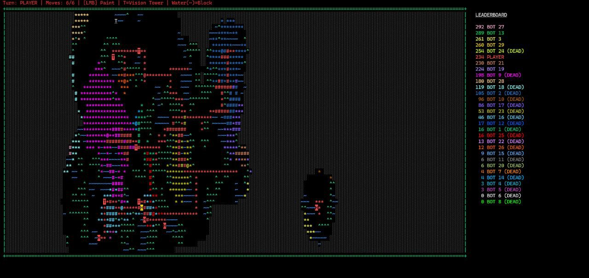
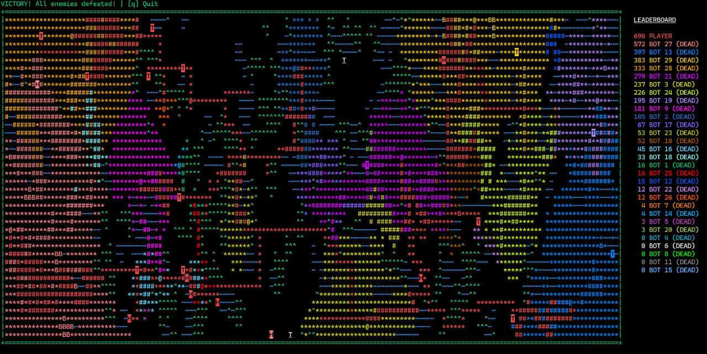

# Fortress & Territories 🏰

Хардкорная пошаговая ASCII-стратегия с процедурной генерацией, туманом войны и умными ботами. Вдохновлена эстетикой Dwarf Fortress и классическими стратегиями.

## 📜 Легенда

В мире символов идет бесконечная война за пространство. Вы — лидер фракции, чья цель — доминировать на поле, захватывая земли, возводя крепости и уничтожая базы соперников.

## 🎮 Основные правила

### 1. Цель игры

Остаться единственным выжившим на карте.

* **Победа:** Уничтожить базы (`@`) всех врагов.
* **Поражение:** Потерять свою собственную базу.

### 2. Ходы

* Игра пошаговая.
* У каждого игрока (и ботов) есть **5 очков действий (ОД)** на ход.
* **Покраска клетки:** Стоит 1 ОД (на обычной земле).
* **Атака:** Стоит 1 ОД.

### 3. Объекты на карте

* `@` **База:** Сердце фракции. Если её закрасит враг — фракция выбывает, а все её земли превращаются в нейтральные крепости.
* `*` **Территория:** Ваша живая земля. От неё можно строиться дальше. Враг может захватить её, превратив в свою крепость.
* `#` **Крепость:** Укрепленная точка.
  * Появляется, когда вы захватываете врага или красите свою же территорию второй раз.
  * **Важно:** Крепость **нельзя** захватить обычным способом (она неуязвима для покраски).
  * Крепость считается "Активной" (от неё можно строить), только если она соединена цепочкой крепостей с Базой или Живой территорией (`*`). Если отрезать крепость от снабжения, она становится бесполезной "мертвой" стеной.

### 4. Ландшафт

*  **Пустота:** Обычная земля. Стоимость хода: **1**.
* `^` **Горы:** Труднопроходимая местность. Стоимость хода: **2**.
* `~` **Вода:** Непроходимое препятствие. Строить нельзя.
* `░` **Туман войны:** Неразведанная территория. Вы видите только то, что находится в радиусе 5 клеток от ваших владений.

## 🕹 Управление

* **ЛКМ (Левая кнопка мыши):**
  * По пустой клетке: Захватить территорию.
  * По вражеской территории (`*`): Атаковать (превратить в свою крепость `#`).
  * По вражеской базе (`@`): Уничтожить фракцию.
* **Q** или **ESC**: Выход из игры.

## 🚀 Установка и запуск

1. Убедитесь, что у вас установлен Python.
2. Установите зависимости (рекомендуется использовать Poetry, но можно и pip):

```bash
pip install windows-curses
# Или для Linux/Mac просто curses (обычно встроен)
```

3. Запуск:

```bash
python main.py
```

В меню выберите количество игроков (2, 4, 8 или 12) с помощью стрелок и нажмите **Enter**.

---

## Примеры геймплея





